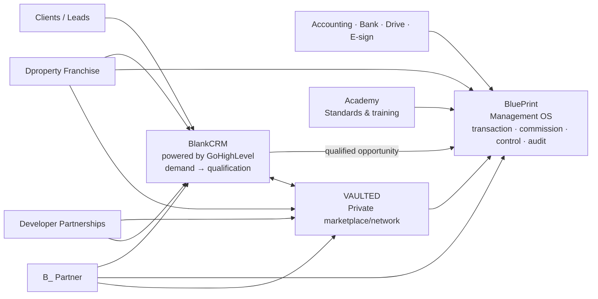

> [!IMPORTANT] Reconciled 2026-09-23
> Read [[00 - Precedence and Canonical Reconciliation]] first. It merges this map with the `19_Canonical_B_RealEstate` baseline and controls the vault.

# B_RealEstate — Ecosystem Master Map

## One-sentence definition

**B_ is operating infrastructure for real-estate businesses: BlankCRM helps the team sell, BluePrint helps management run and control the company from qualified opportunity through commission and audit, and VAULTED connects the company to a transaction network.**

## The handoff line

**BlankCRM owns demand until qualification. BluePrint owns everything after qualification. VAULTED owns network supply and access. Academy owns capability. Accounting remains the ledger.**

## Core architecture

## Product hierarchy

| Product | Core job | Owns | Strategic role |
|---|---|---|---|
| **BluePrint** | Run/control the company | Qualified opportunity → transaction file → compliance evidence → approvals → closing → commission calculation → budgets/variance/KPIs → process assurance → period close → audit | Proprietary SaaS/IP |
| **BlankCRM** | Generate, organize and convert demand | Leads, contacts, messaging, forms/calendars, nurture, pre-qualification pipeline, campaign attribution | Attach/acquisition product; third-party engine |
| **VAULTED** | Access/match network supply and demand | Gated listings, access rules, matches, introductions, attribution, GMV, fees | Network effect + GMV/take-rate upside |
| **Academy** | Teach standards and close capability gaps | Learning content, assessments, certification evidence | Retention/quality/enablement (legacy alias: Building Blocks) |

### What BluePrint does **not** own

Property/project/unit inventory · listing management/MLS · pre-qualification lead pipeline and marketing automation · general ledger, tax, payroll · property management · LMS delivery · marketplace listings and matching.

## Distribution and monetization channels

| Channel | Role |
|---|---|
| **Dproperty Franchise** | Branded, vertically integrated deployment of the stack |
| **B_ Partner** | Managed stack/operating model under customer's own brand |
| **Developer Partnerships** | Revenue + supply + distribution + product learning |
| **Direct SaaS** | BluePrint and/or BlankCRM sold to independent agencies |
| **VAULTED network** | Marketplace participation independent of franchise status where eligible |

## Strategic assets

- **Dproperty** — flagship investment brand/testbed/distribution.
- **Dproperty Select** — HQ-curated opportunities; may appear as a curated collection inside VAULTED.
- Existing developer/broker/investor relationships — cold-start advantage.
- Second Brain/process library — internal institutional knowledge; feeds product/Academy but is not a customer product.

## Long-term option

A physical real-estate innovation hub may remain a future expression of the network, but the software/network business must be valuable and defensible without it.
