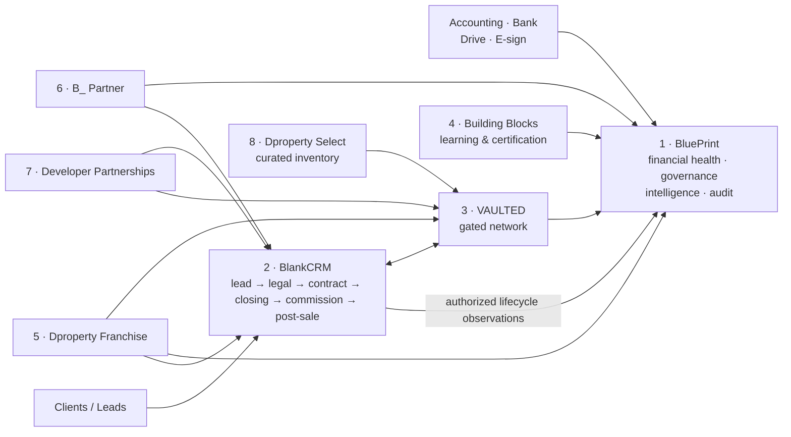

> [!IMPORTANT] Precedence
> [[00 - Precedence and Canonical Reconciliation]] controls this note. Architecture: [[../00_Start_Here/Vault Architecture Map]].

# Offer Portfolio Map

**Everything B_RealEstate can sell, on one page.** An *offer* is anything a customer can buy. Each offer has its own folder under `02_Offers/` with a standard skeleton.

> **Composition principle:** every product is separately definable, priced and sellable, so a package is a **composition of named products**, never one monolith. A product without a standalone list price is not a product. See [[19 - Portfolio Composition Principle]].

## The eight offers

| # | Offer | Type | Job | Price `[A]` unless noted | Folder |
|---|---|---|---|---|---|
| 1 | **BluePrint** | Product — proprietary core | **Agentic back office** — the C-suite without C-suite payroll | Core **$399**/mo · Growth **$799**/mo · **$1,500** setup, per org/office | [[../02_Offers/01_BluePrint/00 - README\|01_BluePrint]] |
| 2 | **BlankCRM** | Product — attach | Sell | **Open** — model from GHL + messaging/AI + support + margin | [[../02_Offers/02_BlankCRM/01 - Definition and Boundaries\|02_BlankCRM]] |
| 3 | **VAULTED** | Product — network | Access the network | Take rate on attributable transactions; 0.35% effective base | [[../02_Offers/03_VAULTED/01 - Definition and Boundaries\|03_VAULTED]] |
| 4 | **Building Blocks** | Product — learning | Operate better | **$199**/enrollment `[A]`; core onboarding included in packages | [[../02_Offers/04_Building_Blocks/01 - Definition and Boundaries\|04_Building_Blocks]] |
| 5 | **Dproperty Franchise** | Channel | Full branded operating model | Entry fee + **6% royalty + 1% restricted brand fund** | [[../02_Offers/05_Dproperty_Franchise/01 - Definition and Boundaries\|05_Dproperty_Franchise]] |
| 6 | **B_ Partner** | Channel | Managed stack under own brand | Entry fee + **4% royalty**, no brand fund | [[../02_Offers/06_B_Partner/01 - Definition and Boundaries\|06_B_Partner]] |
| 7 | **Developer Partnerships** | Channel | Developer sales/supply relationship | Retainer + performance/commission | [[../02_Offers/07_Developer_Partnerships/01 - Definition and Boundaries\|07_Developer_Partnerships]] |
| 8 | **Dproperty Select** | Strategic asset | Curated investment opportunity flow | Retained transaction commission | [[../02_Offers/08_Dproperty_Select/01 - Definition and Boundaries\|08_Dproperty_Select]] |

**All prices are `[A]` assumptions pending paid validation.** Never publish one without a matching model and owner approval. Full detail: [[09 - Unit Economics Registry]].

## Product vs channel vs asset — why the distinction still matters

Navigation is organized by *what we sell*. Strategy is organized by *what creates value*. Do not confuse them in an investor conversation:

- **Products (1–4)** are each standalone and separately sellable. Proprietary value concentrates in **BluePrint** most of all, then VAULTED's network effect — being a standalone product is not the same as being the moat.
- **Channels (5–7)** are distribution and higher-ARPA packaging. They are **not separate software products** and must never be presented as equal businesses.
- **Assets (8)** are differentiated deal flow and proof, not a software line.

**Pitch rule:** BluePrint core SaaS → VAULTED network upside → BlankCRM attach → Building Blocks and channels. See [[03 - Product and Channel Hierarchy]].

## How the offers connect

**The handoff line:** BlankCRM owns full commercial execution through post-sale. BluePrint owns back-office management, financial verification, governance and intelligence; it observes the CRM without executing sales actions. VAULTED owns network supply and access. Building Blocks owns capability. Accounting remains the ledger.

## Boundary table — who owns what

| Domain | Owner | Notes |
|---|---|---|
| Leads, contacts, conversations, campaigns | **BlankCRM** | Powered by GoHighLevel |
| Full commercial execution, legal, approvals, contracts, payment milestones, closing, commissions, post-sale | **BlankCRM** | Source commercial records; bank settlement remains external |
| Evidence-backed financial record: only registers with a valid attachment | **BluePrint** | System of record — CFO function |
| Glitch Report, process intelligence, budgets, variance, KPIs, period close, audit | **BluePrint** | System of record |
| Property/project/unit inventory, listings, MLS | **Developer system / portal / VAULTED** | **Never BluePrint** |
| Gated network listings, matches, introductions, attribution, GMV | **VAULTED** | Separate system |
| Learning content, assessments, certification | **Building Blocks** | Open edX |
| General ledger, tax, payroll | **Accounting platform** | BluePrint reads only |
| Escrow, custody, money movement, FX | **Bank / escrow provider** | BluePrint reads evidence only |
| Binary documents | **Drive / SharePoint / legal archive** | BluePrint governs metadata and links |

Full matrix: [[07 - System of Record and Integration Matrix]].

## Maturity and gate status

| Offer | Status | Next gate |
|---|---|---|
| **BluePrint** | Manage/govern the company | Evidence-backed financial health, expected vs actual cash, expenses, budgets and variance; KPI and CRM-usage oversight; process/Glitch monitoring; policies, management interventions, audit and AI executive support | Proprietary SaaS/IP |
| **BlankCRM** | Definition complete; **price unmodelled** | Build COGS model from GHL plan + messaging/AI + support |
| **VAULTED** | Hypothesis only | **Gated** — no automation before BluePrint stability; needs attribution + legal model per jurisdiction |
| **Building Blocks** | Standalone product; **cost base unquoted** | Quote LMS cost; prove attach via BluePrint signals |
| **Dproperty Franchise** | Operating material strong; economics unreconciled | Contract design + local advice on royalty structure |
| **B_ Partner** | Definition clear; pricing to rebuild | Founding-partner offers; validate 4% royalty acceptance |
| **Developer Partnerships** | Legacy commercial structures; fee bases unclear | Clarify fee base before external publication |
| **Dproperty Select** | Active, HQ-governed | Verify signed agreements before investor use |

## Naming — canonical vs legacy

| Canonical | Legacy alias — do not use in new work |
|---|---|
| BluePrint | Dproperty OS · Plano · "La Plataforma" |
| Building Blocks | Academy · B_Academy · Training Academy |
| BlankCRM | "CRM propio" · proprietary CRM |
| B_ Partner | White-Label · White-Label OS |
| Developer Partnerships | Developer Sales OS |
| Dproperty Select | Private Collection |
| *(none — parked)* | **DpropertyLiving** → [[../98_Archive/Parked/DpropertyLiving - Parked]] |

## Adding a new offer

1. Create `02_Offers/0X_Name/` with the standard skeleton (`00 - README` … `07 - Investor Two-Pager`).
2. Write `01 - Definition and Boundaries.md` first — state what it owns **and what it does not own**.
3. Register it here and in [[03 - Product and Channel Hierarchy]].
4. Classify it: product, channel or asset. If it is a channel, say so explicitly so it is never pitched as a product.
5. Add a row to the maturity table with an honest gate.
