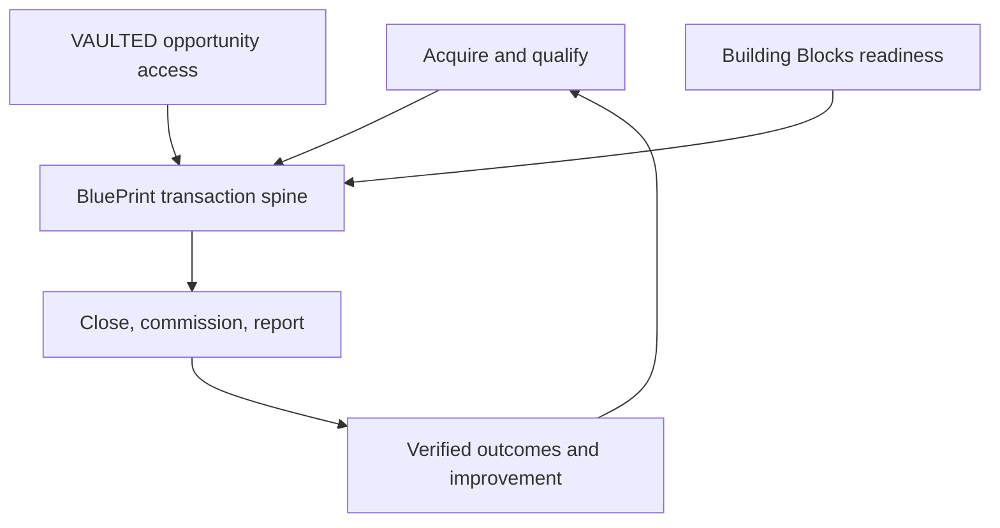

> [!IMPORTANT] Reconciled 2026-09-23 — read the precedence note first
> [[00 - Precedence and Canonical Reconciliation|18 - Canonical Reconciliation and Precedence]] controls the vault. This folder is **one of three canonical layers**, not the sole authority:
>
> - `01_Canon/` — what the company **is**
> - `02_Offers/01_BluePrint/` — what the product **is**
> - `01_Canon/` — **this folder**: how it is **proven and financed** (finance models, data/AI architecture, operations, compliance, KPIs/gates, investor diligence)
>
> **Naming corrections that override this folder:** **Building Blocks** (not *Academy* / *B_Academy*) · **B_ Partner** (not *White-Label*) · **Dproperty Select** (not *Private Collection*) · **Developer Partnerships** (not *Developer Sales OS*).
>
> **BluePrint is both halves:** the transaction/commission spine from qualified opportunity **and** the management-control layer (budgets, variance, process assurance, Glitches, period close). It never owns property/unit inventory, listings or MLS.

# B_RealEstate Ecosystem — Executive Summary

The ecosystem is one universe with modular products and explicit systems of record. Its unifying asset is the transaction spine—not a shared logo or a bundle of unrelated tools.

## Components

| Component | Owns | Does not own |
|---|---|---|
| bfranchising.com | Public acquisition, explanation, qualification, application | Authenticated operations |
| BlankCRM/CRM | Lead capture, marketing, communications, appointments, early pipeline | Compliance, authoritative close/commission |
| BluePrint | Organization, transaction, evidence, documents, approvals, closing, commissions, reporting, Copilot | General CRM, escrow/custody |
| Building Blocks | Curriculum, enrollment, completion, certification | Daily transaction execution |
| VAULTED | Gated supply/demand access, deal rooms, distribution and attribution | Open portal, pooled investment, money movement |
| Dproperty | Brokerage/franchise brand and licensed local operations | Neutral platform ownership of partner data |
| B_Franchising | Partner offers, standards, onboarding and support | Product source code or regulated brokerage by default |
| Second Brain | Approved internal knowledge, decisions, policies, templates and source map | Uncontrolled file dump or public AI training corpus |

## Standalone and bundled logic

Each product must have a reason to buy independently. Bundling may reduce implementation friction but must not conceal price, entitlements, data roles or margin. Franchise customers receive defined inclusions; free periods are not recognized as software revenue. External software customers are not required to join a franchise. Developer partners can use project/distribution modules without adopting Dproperty.

## Ecosystem value flywheel

1. Building Blocks produces ready users and qualified demand.
2. CRM and partner channels generate qualified opportunities.
3. BluePrint converts opportunities into governed transactions.
4. VAULTED expands approved supply and distribution.
5. Completed transactions create verified attribution, templates and benchmark data.
6. Better outcomes improve partner acquisition, onboarding and retention.

This becomes a network effect only when each additional participant improves measurable value for others without proportional service cost. Until then it is a cross-sell hypothesis.

## Corporate/data neutrality

Non-Dproperty organizations need contractually credible isolation, control, export, and permitted-use terms. Dproperty HQ cannot see competitor customer data by default. Platform support access is explicit, logged, reasoned and time-bound. Cross-tenant benchmarks require aggregation thresholds, minimization and contractual/privacy authority.

## Strategic sequence

BluePrint proof → repeatable implementation → partner/franchise reference offices → controlled developer supply → narrow VAULTED corridor → scaled network. BlankCRM and Building Blocks accelerate the sequence; they do not replace it.

