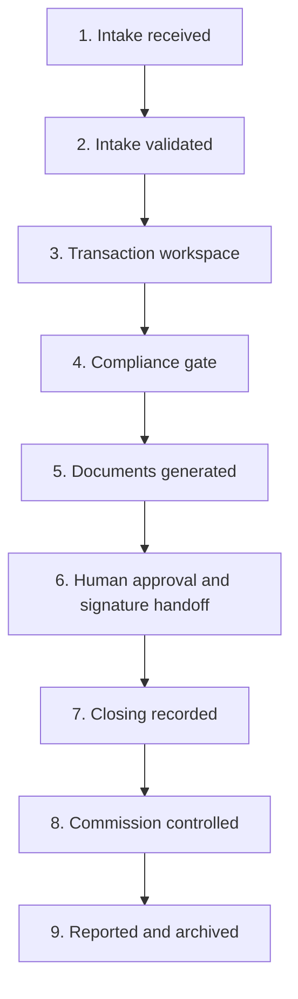

# BluePrint Golden Workflow — Wireframe and Validation

> **Scope:** This document designs and desk-tests the canonical BluePrint MVP journey. It validates the information architecture and workflow rules; it is not evidence that production software has been implemented or technically tested.

> **Controlling document:** [[BluePrint Product Constitution]]. If a screen or scenario conflicts with the Constitution, the Constitution wins until a formal change decision is recorded.

## 1. Validation question

Can one product—with configuration and intake adapters, not separate codebases—take all three customers through the same operational journey?

1. Independent agency using its own CRM.
2. Dproperty franchise using GoHighLevel.
3. Small agency using BluePrint manually.

Required journey:

**CRM/manual intake → transaction workspace → compliance → document generation → approval → closing → commission → report**

The Copilot must provide useful assistance at every stage without gaining legal, compliance, signature, payment or final-approval authority.

## 2. Golden-workflow invariants

These rules do not change by tenant or CRM mode:

- One normalized Intake enters BluePrint.
- One validated Intake creates or links to one Transaction.
- One Transaction has one current stage, one accountable operational owner and visible next action.
- Stage progress is controlled by configured requirements, not by hidden UI logic.
- Documents are generated from approved versioned templates and structured data.
- Consequential decisions are performed by authorized humans.
- Commission outputs come from deterministic rules and require review/approval.
- Reports use governed metric definitions and a dated snapshot.
- Every important change produces an audit event.
- The Copilot sees only the data the requesting user is authorized to see.

## 3. Workflow and states

| Step | Entry condition | Exit condition | Primary accountable role |
|---|---|---|---|
| Intake received | Source event/manual submission accepted | Required intake fields and duplicate checks reviewed | Operations Coordinator |
| Intake validated | Valid source, party and opportunity snapshot | Existing/new transaction decision recorded | Operations Coordinator |
| Transaction workspace | Transaction created with owner and next action | Required parties/project/unit/workflow configuration selected | Transaction owner |
| Compliance gate | Applicable requirements instantiated | Required evidence approved or authorized exception recorded | Compliance reviewer |
| Documents generated | Data schema and approved template available | Complete draft package generated and reviewed for missing data | Document preparer |
| Approval/signature | Draft package ready | Required internal approvals complete and e-signature/external execution initiated | Authorized approver |
| Closing | Execution/reservation evidence received | Outcome, dates, amounts and external references confirmed | Operations + Finance |
| Commission | Closed-won economics available | Calculation approved and payout/reconciliation status recorded | Finance approver |
| Report | Material records complete | Snapshot issued and transaction archived/monitored | Principal/manager |

## 4. Actors used in the wireframe

| Role | Primary responsibility | Important restrictions |
|---|---|---|
| Principal / Agency Owner | Management oversight, exceptions and authorized approvals | Does not silently bypass controls |
| Sales Advisor / Transaction Owner | Client/property context, commercial progress and next action | Cannot approve own restricted compliance/finance decisions where separation is required |
| Operations Coordinator | Intake quality, checklist orchestration, documents and closing record | Cannot sign on behalf of parties or release money |
| Compliance Reviewer | Review evidence, decide pass/fail/request-more and document exceptions | Only applicable authorized records |
| Finance Approver | Validate commission basis, approve statement and reconcile status | Does not edit approved rules without governance |
| Copilot | Explain, retrieve, summarize, draft and prepare confirmed low-risk actions | Cannot approve, sign, pay, publish templates or waive controls |

Tenant role mapping may use different job titles, but these responsibilities remain abstract and configurable.

## 5. Global application shell

| Region | Contents | Behavior |
|---|---|---|
| Global header | Tenant/workspace switcher, universal search, notifications, help, user menu | Tenant switch changes the entire authorization context |
| Primary navigation | Home, Transactions, Projects & Inventory, Documents, Tasks & Approvals, Finance, Reports, Knowledge, Integrations, Administration | Capabilities appear according to role and entitlement |
| Page header | Record title, status, owner, risk/blocker indicator, next action, primary action | Always answers “what is this and what happens next?” |
| Main canvas | Stage-specific information and work surface | Structured inputs before free-text attachments |
| Context rail | Checklist, activity, related records and deadlines | Collapsible; preserves operational context |
| Copilot panel | Suggested questions, conversation, citations, draft/action preview and cost/usage indicator | Opens with the current page/record context; user can remove context |
| Audit drawer | Material changes, decisions, integrations and AI actions | Readable by authorized roles; immutable events |

### Home screen

| Block | Content | Primary action |
|---|---|---|
| Attention now | Blocked transactions, overdue tasks, approvals and sync failures | Open the item requiring action |
| Transaction health | Counts/value by stage, aging and at-risk list | Filter Transactions |
| Closing and commissions | Expected closings, approved/unapproved commissions and reconciliation exceptions | Open Finance work queue |
| Team workload | Assigned/overdue work by role | Reassign or inspect capacity |
| Weekly summary | Governed KPI snapshot and last-issued report | Generate/review report |
| Copilot prompt | “Ask about your operation” plus context suggestions | Open Copilot |

## 6. Screen-by-screen wireframe

### Screen 1 — Intake Inbox

**Purpose:** Normalize a CRM event, CSV row or manual submission before it becomes operational truth.

| Main canvas | Context rail | Primary actions | Copilot at this stage |
|---|---|---|---|
| Intake source/mode; external record link; person/organization; opportunity summary; project/unit interest; owner; consent flags; received/sync status; duplicate candidates; missing fields | Raw-source event metadata; mapping version; integration errors; activity | Validate; link duplicate; return for correction; reject with reason; create transaction | “Summarize this intake”; “What is missing?”; “Compare duplicate candidates”; “Explain why it failed mapping” |

Rules:

- No marketing conversation history is copied unless explicitly needed and authorized.
- “Create transaction” is unavailable until minimum intake requirements pass.
- Replayed source events use the idempotency key and cannot create a duplicate transaction.

### Screen 2 — Transaction Overview

**Purpose:** Give one operational home to the opportunity after qualification.

| Main canvas | Context rail | Primary actions | Copilot at this stage |
|---|---|---|---|
| Stage; accountable owner; next action; parties; project/unit; key dates; value/currency; current blockers; progress; milestone timeline | Open tasks; missing items; recent activity; source CRM link | Assign owner; select workflow; link inventory; create task; advance when eligible | “Brief me on this transaction”; “What should happen next?”; “Create the standard task plan”; “Draft a client-information request” |

The page shows source provenance beside shared fields. An authorized user may correct BluePrint-owned transaction fields but not silently overwrite CRM-owned fields.

### Screen 3 — Compliance Workspace

**Purpose:** Instantiate applicable requirements and prevent uncontrolled progression.

| Main canvas | Context rail | Primary actions | Copilot at this stage |
|---|---|---|---|
| Requirements grouped by party/transaction/market; evidence status; reviewer; expiry; pass/request-more/reject; exception record | Policy source; evidence references; comments; deadlines; separation-of-duty warning | Request evidence; submit review; decide; escalate; record authorized exception | “Explain this requirement”; “List missing evidence”; “Summarize the evidence for the reviewer”; “Draft the request for additional information” |

Guardrails:

- The Copilot cannot mark a requirement passed or approve an exception.
- Summaries cite the evidence and governing policy version.
- Sensitive evidence is filtered by record permissions before AI retrieval.

### Screen 4 — Document Builder

**Purpose:** Create a controlled draft from an approved template and validated inputs.

| Main canvas | Context rail | Primary actions | Copilot at this stage |
|---|---|---|---|
| Document type; jurisdiction/use case; approved template/version; structured field form; missing/conflicting inputs; generated preview; clause/data provenance | Template notes; required approvals; related evidence; prior versions | Generate draft; regenerate changed sections; compare version; submit for approval | “Choose the applicable approved template”; “Explain this clause”; “Fill available fields”; “Summarize what is still missing” |

Generation record includes template/version, structured input snapshot, requesting user, model/tool use, generated time and document checksum/reference.

### Screen 5 — Approval Center

**Purpose:** Make consequential review explicit and attributable.

| Main canvas | Context rail | Primary actions | Copilot at this stage |
|---|---|---|---|
| Approval package; differences from template; missing fields; risk flags; approval chain; comments; decision history | Policy and authority basis; related compliance decisions; deadlines | Approve; reject; request changes; prepare e-signature handoff | “Summarize changes from the approved template”; “List unresolved risks”; “Draft a response to the preparer” |

The Copilot may prepare the handoff but cannot approve, sign or send without the required human action.

### Screen 6 — Signature and Closing

**Purpose:** Track specialist execution and confirm the authoritative operational outcome.

| Main canvas | Context rail | Primary actions | Copilot at this stage |
|---|---|---|---|
| E-signature envelope/external reference; signer statuses; reservation/closing milestones; executed-document reference; price/commission basis; closing checklist; outcome | Provider events; deadlines; exceptions; file links | Refresh provider status; record external execution; confirm closing; close-lost/cancel with reason | “Who has not signed?”; “Summarize outstanding closing items”; “Prepare the closing handoff”; “Explain the difference between expected and confirmed values” |

Money movement and signature evidence remain in specialist systems. BluePrint records status, references and controlled outcome fields.

### Screen 7 — Commission Statement

**Purpose:** Calculate, review and reconcile transaction economics without model arithmetic.

| Main canvas | Context rail | Primary actions | Copilot at this stage |
|---|---|---|---|
| Effective commission rule/version; calculation basis; waterfall; expected/approved/paid amounts; recipient allocations; invoice/payment references; reconciliation exception | Rule source; transaction facts; approval history; audit | Recalculate deterministically; submit; approve/reject; attach invoice/payment reference; mark reconciled | “Explain this calculation”; “Show what changed”; “Identify missing payout information”; “Draft the commission summary” |

The calculation service produces the numbers. The Copilot explains inputs and outputs but does not calculate by free-form language-model arithmetic.

### Screen 8 — Report Builder and Snapshot

**Purpose:** Turn completed operational data into a reproducible management view.

| Main canvas | Context rail | Primary actions | Copilot at this stage |
|---|---|---|---|
| Report type/period; metric definitions; transaction and commission summaries; exceptions; narrative draft; data-as-of time; snapshot version | Source records; prior report; material changes; distribution permission | Generate snapshot; review narrative; approve/publish internally; export | “Create the weekly operations narrative”; “What changed since last week?”; “Explain this KPI”; “List the five issues leadership should discuss” |

The report is never silently recomputed after issuance. Corrections create a new snapshot/version.

## 7. Copilot interaction contract across the workflow

| Stage | Default context | Highest permitted MVP level | Required evidence in output |
|---|---|---|---|
| Intake | Intake + mapping/error metadata | AI-3 prepare | Source system/event and missing fields |
| Transaction | Transaction + authorized related records | AI-3 prepare | Record links, status timestamp |
| Compliance | Requirements + authorized evidence + policy | AI-2 draft | Policy/evidence citations; no decision |
| Documents | Approved template + structured inputs | AI-2 draft | Template/version and field provenance |
| Approval | Draft package + diffs + authority rules | AI-2 draft | Changes, unresolved items, authority source |
| Closing | Provider statuses + checklist + outcome fields | AI-3 prepare | Provider event/reference and as-of time |
| Commission | Deterministic calculation result + rule | AI-2 draft | Rule/version, inputs and calculation output |
| Report | Governed metrics + snapshot period | AI-2 draft | Metric definitions, period and sources |

At every stage, the user can inspect/remove context before sending, open cited records, see whether the answer used company knowledge or transaction data, and report an incorrect response.

## 8. Intake-mode adapter matrix

| Concern | Mode A: GoHighLevel | Mode B: External CRM | Mode C: BluePrint Direct | Core workflow after validation |
|---|---|---|---|---|
| Trigger | Configured qualified stage/event | Standard webhook/API or supported connector | Guided form or CSV import | Same |
| Front-office record owner | GoHighLevel | Customer CRM | None/BluePrint operational snapshot only | Unchanged |
| External ID/link | Required | Required for connected records | Not applicable or import-row reference | Same fields allow null where legitimate |
| Field mapping | B_RealEstate preset + tenant configuration | Customer mapping profile | Form schema/import mapping | Produces one canonical Intake |
| Duplicate protection | Source event + external ID + party matching | Source event + external ID + party matching | Import idempotency + party/opportunity matching | Same duplicate-review screen |
| Status returned | Configured milestones/outcome | Standard outbound event where supported | None | No workflow fork |
| Ecosystem entitlements | According to contract | Optional according to contract | Optional according to contract | Entitlements add modules/data, not states |

## 9. Desk-test fixtures

The tests deliberately vary the intake mode, branding and ecosystem entitlement while keeping the transaction type and required workflow comparable.

### Scenario A — Independent agency with its own CRM

- Tenant: independent boutique agency.
- Mode: External CRM Connected.
- Brand: agency's own brand.
- Ecosystem entitlement: none required.
- Inputs: qualified buyer opportunity, CRM contact/opportunity IDs, project/unit reference, transaction owner.
- Knowledge: customer's SOP and approved NDA/reservation template.
- Expected result: closing and commission report completed without GoHighLevel, Dproperty, Open edX, VAULTED or Dproperty Select.

### Scenario B — Dproperty franchise with GoHighLevel

- Tenant: Dproperty branded franchise.
- Mode: Ecosystem Connected.
- Brand: Dproperty.
- Ecosystem entitlement: configured GoHighLevel, Dproperty operating standards, B_Academy completion reference and approved Dproperty Select inventory where applicable.
- Inputs: GoHighLevel-qualified investor, approved project/unit reference, transaction owner.
- Expected result: same core closing/commission/report path with ecosystem data and controls layered in.

### Scenario C — Small agency using BluePrint manually

- Tenant: small independent agency.
- Mode: BluePrint Direct.
- Brand: agency's own brand.
- Ecosystem entitlement: none required.
- Inputs: guided manual intake, project/unit data or reference, transaction owner.
- Knowledge: customer's uploaded/linked approved procedures and templates.
- Expected result: same core transaction path without CRM configuration or a reduced “lite” workflow.

## 10. Scenario execution trace

### Test A — External CRM Connected

| Step | Test action | Expected result | Result |
|---|---|---|---|
| Intake | Receive standard qualified-opportunity webhook twice | First event creates Intake; replay is idempotent; source CRM remains linked | PASS — supported by connector contract |
| Validate | Review mapped fields and missing consent/status metadata | User sees missing/owned fields and can request correction without creating a transaction | PASS |
| Workspace | Create transaction and assign owner/workflow | Canonical transaction opens; no GoHighLevel dependency appears | PASS |
| Compliance | Apply tenant/market requirements and submit evidence references | Same Compliance Workspace and human decision controls | PASS |
| Documents | Generate customer-branded NDA/reservation draft | Uses customer's approved template/version; Copilot remains AI-2 | PASS |
| Approval | Authorized approver reviews diffs and approves | Same Approval Center and audit trail | PASS |
| Closing | Track external signature, confirm close | Provider/file references stored; no duplicate file/signature engine | PASS |
| Commission | Apply tenant's configured deterministic rule | Statement requires Finance approval and keeps rule version | PASS |
| Report | Generate weekly snapshot and optionally return milestone to CRM | Same governed report; outbound event uses standard connector | PASS |

### Test B — Dproperty + GoHighLevel

| Step | Test action | Expected result | Result |
|---|---|---|---|
| Intake | GoHighLevel opportunity reaches configured qualified stage | Preset adapter creates canonical Intake with GHL ID/link | PASS |
| Validate | Confirm investor and opportunity snapshot | Same Intake Inbox; only mapping preset differs | PASS |
| Workspace | Link approved Dproperty Select project/unit | Same transaction entity; inventory entitlement supplies approved reference/version | PASS |
| Compliance | Instantiate market/Dproperty requirements; check relevant Academy readiness | Same compliance model; Open edX contributes completion status only | PASS |
| Documents | Generate approved Dproperty package | Same builder; entitlement changes available templates/brand | PASS |
| Approval | Operations/compliance/authorized approver complete decisions | Same authority controls | PASS |
| Closing | Record execution and Select transaction outcome | Same closing stage; ecosystem reference retained | PASS |
| Commission | Apply approved Dproperty/Select rule version | Same calculation engine; configured rule differs | PASS |
| Report | Issue tenant report and send allowed milestone/outcome to GoHighLevel | Same report; GHL receives selected operational status | PASS |

### Test C — BluePrint Direct

| Step | Test action | Expected result | Result |
|---|---|---|---|
| Intake | Authorized user submits guided form, then imports the same row | Manual Intake is created; duplicate candidate is flagged before transaction creation | PASS |
| Validate | Complete required fields and confirm no external CRM | Same minimum validation; external references remain legitimately empty | PASS |
| Workspace | Create transaction and select tenant workflow | Same workspace, state model and ownership | PASS |
| Compliance | Instantiate small-agency market requirements | Same compliance engine; no ecosystem dependency | PASS |
| Documents | Generate agency-branded approved document | Same builder using customer template | PASS |
| Approval | Principal/authorized role approves | Same Approval Center; separation rules configurable but explicit | PASS |
| Closing | Record external/manual signing reference and closing evidence | Same closing fields and audit evidence | PASS |
| Commission | Apply small-agency rule and approve | Same deterministic service and statement | PASS |
| Report | Generate management snapshot | Same metrics based on BluePrint operational data | PASS |

## 11. Architecture-test verdict

**Result: PASS at product-architecture level.** All three scenarios complete the same canonical workflow, state model, core entities, screens and Copilot permission contract.

The required variation is contained in configuration and adapters:

- Intake trigger and field mapping.
- External-system references and outbound milestones.
- Tenant brand and approved templates.
- Market/business-line requirements.
- Commission rule version.
- Ecosystem entitlements and data sources.

No separate “Dproperty BluePrint,” “external-CRM BluePrint” or “small-agency BluePrint” product is required.

This is a desk-test verdict. Implementation must still prove API behavior, authorization, idempotency, calculations, AI grounding, document generation and performance.

## 12. Exceptions and failure-state tests

| Failure/exception | Required product behavior | Copilot role |
|---|---|---|
| Duplicate source event | Do not create a second Intake/Transaction; show linked result | Explain idempotency result |
| Possible duplicate party/opportunity | Hold for authorized review | Summarize candidate similarities; never merge autonomously |
| CRM unavailable | Queue/retry inbound or outbound event; show sync age/error | Explain failure and safe next action |
| Missing required intake data | Block transaction creation or mark incomplete according to configuration | List missing fields and draft correction request |
| Conflicting CRM/BluePrint value | Apply field ownership rule; show conflict | Explain owner/provenance; prepare proposed correction |
| Expired/insufficient compliance evidence | Block affected progression | Cite requirement and request new evidence |
| User lacks access to evidence | Hide content and actions server-side | State lack of permission without revealing content |
| Template expired/not approved | Prevent generation | Locate approved alternative or escalate |
| AI cannot ground answer | Refuse to invent; show missing/conflicting sources | Ask for clarification or direct user to owner |
| E-signature provider unavailable | Preserve approved package; queue/retry handoff or allow authorized external-reference workflow | Explain status; never claim sent/signed |
| Closing facts differ from expected | Require confirmation and preserve variance | Summarize variance; do not overwrite silently |
| Commission rule missing/conflicting | Block statement approval | Identify missing rule; no free-form calculation |
| Report source corrected after issuance | Create corrected version; retain prior snapshot | Explain changes and affected KPIs |

## 13. MVP prototype acceptance criteria

### Cross-mode

- [ ] Each mode produces the same canonical Intake and Transaction schemas.
- [ ] No screen after Intake contains mode-specific core business logic.
- [ ] A tenant can change CRM without migrating transaction history into another product model.
- [ ] External field ownership and sync direction are visible and enforceable.
- [ ] Manual intake does not expose marketing automation features.

### Workflow

- [ ] Stage advancement is blocked by unmet configured requirements.
- [ ] Every transaction shows owner, next action, blocker and audit history.
- [ ] Templates, requirements and commission rules are effective-dated/versioned.
- [ ] Closing, commission and report values can be traced to source fields and rules.
- [ ] Exceptions require reason, authority and an audit event.

### Copilot

- [ ] Retrieval respects tenant, role and record access before model invocation.
- [ ] Company/process answers cite authorized sources.
- [ ] Document drafts identify template/version and missing inputs.
- [ ] Metrics and commissions come from governed services, not model arithmetic.
- [ ] AI-3 actions show a preview and require confirmation.
- [ ] AI cannot perform AI-4 decisions/actions.
- [ ] AI run, tools, sources, confirmation, output status and cost are auditable.

### Usability

- [ ] A new user can identify what needs attention from Home.
- [ ] Each stage has one clear primary action.
- [ ] Keyboard, focus, labels, errors and reduced-motion behavior meet the agreed accessibility baseline.
- [ ] The same scenario can be demonstrated without hidden administrator intervention.

## 14. Prototype route map

| Route | Screen | Golden-workflow use |
|---|---|---|
| `/home` | Operational cockpit | Attention, health, commissions and report |
| `/intakes` | Intake Inbox | Normalize all three source modes |
| `/transactions` | Transaction list | Search/filter operational work |
| `/transactions/:id` | Transaction Overview | Core record and next action |
| `/transactions/:id/compliance` | Compliance Workspace | Requirements/evidence/decision |
| `/transactions/:id/documents` | Document Builder | Template-driven drafts |
| `/approvals` | Approval Center | Human-controlled decisions |
| `/transactions/:id/closing` | Signature and Closing | Specialist status and outcome |
| `/transactions/:id/commission` | Commission Statement | Calculation, approval and reconciliation |
| `/reports/:id` | Report Snapshot | Governed management output |
| `/knowledge` | Knowledge | Approved procedures/templates/policies |
| `/integrations` | Connections and event log | CRM/provider configuration and errors |
| `/admin` | Tenant, roles and workflow configuration | Authorized configuration only |

The Copilot is a panel/command surface within these routes, not a separate general-chat destination.

## 15. Prototype build order

1. Application shell, tenancy, roles and audit primitives.
2. Canonical Intake schema, manual form and Intake Inbox.
3. Transaction Overview and state/requirements engine.
4. Compliance Workspace and approval primitive.
5. Template registry, Document Builder and generated-document provenance.
6. Signature/closing references and milestone events.
7. Deterministic commission service and statement.
8. Governed report snapshot.
9. Copilot AI-0/AI-1 grounded retrieval and summaries.
10. Copilot AI-2 drafting and AI-3 confirmed low-risk actions.
11. GoHighLevel adapter and standard external-CRM webhook/API.
12. End-to-end automated tests for the three fixtures and failure states.

## 16. Next validation gate

Create a clickable prototype using the routes and acceptance criteria above, then run five participants through the same task script without explaining the navigation:

- One Dproperty operations user.
- One Dproperty sales user.
- One independent agency owner using another CRM.
- One operations coordinator from an independent/small agency.
- One compliance/finance reviewer.

Record task completion, errors, requests for help, terminology confusion, time per stage and whether the Copilot increased confidence without masking the source of truth. Implementation scope changes only after this evidence is reviewed.
