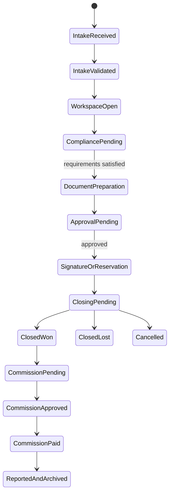

# BluePrint Product Constitution

> **Decision authority:** This is the definitive product-boundary document for BluePrint. Product briefs, wireframes, roadmaps and implementation decisions must conform to it. A material change requires a dated entry in [[../00_Index/Decision Log|Decision Log]] and corresponding updates here, in [[Platform Information Architecture]], [[MVP Scope]], and in the ecosystem maps.

## 1. Product promise

**BluePrint gives a real-estate company a professional back office from day one.** It converts a qualified opportunity into a controlled, documented and financially visible transaction while coordinating the specialist systems the company already uses.

Standalone promise:

> Run the agency's back-office operation with clear responsibilities, compliant workflows, approved documents, commission control and reliable management information—even when the agency uses another CRM or no connected CRM.

Ecosystem promise:

> Connect the same BluePrint workspace to B_RealEstate's training, curated inventory, off-market marketplace, operating standards, benchmarks and shared services without changing the core product.

The measurable outcome is not “everything in one place.” It is **fewer missed steps, faster document preparation, lower administrative effort, fewer commission errors, clearer accountability and more reliable closings**.

## 2. Product category and boundary

BluePrint is a **multi-tenant real-estate back-office operating platform and system of operational record**.

It is:

- The transaction workspace after a lead becomes operationally qualified.
- The control layer for compliance gates, documents, tasks, approvals and commissions.
- The structured operational memory of the agency.
- The management layer for back-office metrics and reporting.
- The governed interface through which the BluePrint Copilot reads company knowledge and prepares permitted work.
- Connector-neutral: it supports GoHighLevel, other CRMs and manual intake through the same domain model.

It is not:

- A lead-generation or marketing automation platform.
- A replacement for GoHighLevel or another CRM.
- A general-purpose chatbot.
- An LMS or course-delivery engine.
- An off-market marketplace.
- A file-storage replacement.
- An e-signature provider.
- A bank, payment rail, escrow provider or general ledger.
- A source of legal, tax, financial or investment advice.
- A promise that every ecosystem component shares one physical database.

## 3. Product principles

1. **Standalone first, ecosystem amplified.** Every agency receives a complete core workflow; B_RealEstate integrations add leverage rather than unlock basic operability.
2. **One operational spine.** All customers use the same transaction state model. CRM choice changes the intake adapter, not the product.
3. **One owner per fact.** Every important field has a declared system of record and synchronization direction.
4. **Structured data creates documents.** Approved templates and governed inputs generate documents; documents do not become the hidden database.
5. **Human accountability survives automation.** AI may explain, analyze, draft and prepare actions, but accountable people approve legal, compliance and financial consequences.
6. **Need-to-know by default.** Tenant isolation, role permissions and record-level access apply to users, integrations and AI alike.
7. **Explain before surprise.** Status, calculations, AI sources and blocked steps must be understandable.
8. **Exceptions are visible.** A bypass requires authority, reason and an audit event; it cannot silently erase a control.
9. **Integrate specialist tools; do not recreate them.** BluePrint stores references, status and evidence while the specialist platform performs its specialist job.
10. **Measure outcomes.** Features are justified by operational time saved, control improvement, transaction quality or revenue visibility.

## 4. What BluePrint owns

| Domain | BluePrint responsibility | Canonical record |
|---|---|---|
| Tenant operations | Company workspace, market configuration, business line and operating settings | Tenant and workspace records |
| Identity authorization | BluePrint roles, permissions and record access; federated identity may come from an external identity provider | Role assignments and access policy |
| Opportunity handoff | Operational snapshot of a qualified opportunity and link to its originating CRM record | Intake record + external reference |
| Transaction | Stage, operational owner, requirements, deadlines, blockers, decision trail and outcome | Transaction workspace |
| Project/unit operations | Approved project/unit facts required to execute a transaction; provenance and external source retained | Project/unit operational master |
| Compliance workflow | Requirements, evidence status, reviews, exceptions and approval gates | Compliance check records |
| Template governance | Approved template, jurisdiction, use case, version, effective dates and required inputs | Template registry |
| Generated documents | Draft/final status, template lineage, input snapshot, approval and specialist-storage link | Document record and audit evidence |
| Work coordination | Tasks, owners, due dates, dependencies, escalation and completion evidence | Task and approval records |
| Commission control | Calculation basis, waterfall, expected/approved/paid status and reconciliation references | Commission statement |
| Operational reporting | BluePrint-derived KPIs, workflow health, close status and management reports | Metric definitions and report snapshots |
| Company knowledge | Indexed, permission-filtered references to approved manuals, policies, procedures and templates | Knowledge-source registry |
| AI activity | Request context, sources, draft/action, cost, confirmation and result | AI run and tool-action log |
| Audit | Who changed what, when, why, through which interface and under what authority | Immutable audit event |

## 5. What external systems own

| External system | It owns | BluePrint stores/uses |
|---|---|---|
| GoHighLevel or another CRM | Lead capture, marketing source, conversations, campaigns, nurturing, appointments and pre-handoff qualification | External ID, qualified snapshot, selected shared fields and operational status returned to CRM |
| Open edX | Course content, enrollment, learning activity, assessments and certificates | Identity link, relevant completion/certification status and expiry used for readiness gates |
| VAULTED | Off-market discovery, listing visibility, marketplace access and marketplace engagement | Listing reference and transaction created after an authorized handoff |
| Dproperty Select governance | HQ approval of curated inventory, controlled assumptions, commercial terms and approved materials | Approved project/unit reference and effective version used in a transaction |
| Drive/SharePoint or approved document store | Binary files and folder retention where policy assigns it | Stable file link, metadata, checksum/version reference and access status |
| E-signature provider | Signing ceremony, signer authentication and signature evidence | Envelope ID, status, signed-file reference and evidence link |
| Accounting/payment provider | Ledger, invoices, taxes, money movement, reconciliation and payment evidence | Expected amounts, external transaction/invoice IDs and reconciliation status |
| Identity provider | Authentication and identity proofing when configured | Tenant membership, application role and last verified identity reference |

**Rule:** “Integrated” never means “duplicated without ownership.” The [[../18_Ecosystem/12 - System of Record and Integration Matrix|System of Record and Integration Matrix]] controls the wider ecosystem boundary.

## 6. Three CRM operating modes

All three modes create the same `Intake` and `Transaction` records and enter the same workflow.

### Mode A — Ecosystem Connected

**Customer:** Dproperty franchise or B_RealEstate partner using the configured GoHighLevel environment.

- GoHighLevel owns lead capture, communication and qualification.
- A configured qualifying stage/event creates a BluePrint intake.
- BluePrint returns operational status, selected milestone and closing outcome.
- Identity may be federated for a unified experience.
- Ecosystem inventory, Academy and benchmark features may be enabled by entitlement.

### Mode B — External CRM Connected

**Customer:** Independent agency retaining its own CRM.

- The customer's CRM remains the front-office source of truth.
- Intake arrives through the standard API/webhook contract or a supported connector.
- External IDs and field ownership prevent duplicate records and sync loops.
- Only the minimum authorized client/opportunity information is transferred.
- BluePrint returns operational milestones through the same integration contract where supported.

### Mode C — BluePrint Direct

**Customer:** Small/new agency without a connected CRM, or an agency operating temporarily without integration.

- Authorized users create an intake through a guided form or CSV import.
- BluePrint stores only the operational contact/opportunity snapshot required for the transaction.
- BluePrint does not add campaign, bulk messaging or nurture functionality.
- The same workflow begins after validation; no “lite” transaction model is created.

### Connector contract

Every intake records:

- `tenant_id`
- `intake_id`
- `source_mode`
- `external_system`
- `external_record_id`
- `external_record_url`
- `source_event_id` or import batch
- `received_at`
- `last_synced_at`
- field ownership map
- consent/privacy flags received from the source
- idempotency key
- processing and error state

Repeated events must update or reject safely; they must not create duplicate transactions.

## 7. Core data entities

| Domain | Core entities | Purpose |
|---|---|---|
| Tenancy and security | Tenant, Workspace, Market, User, Role, Permission, Membership | Isolation and authorized access |
| Parties | Person, Organization, Party Role, Contact Reference | Transaction participants without recreating CRM marketing history |
| Intake | Intake, Source Reference, Qualification Snapshot, Assignment | Normalize CRM/manual entry |
| Transaction | Transaction, Stage, Milestone, Activity, Exception, Outcome | Operational spine |
| Inventory | Project, Unit, Listing Reference, Availability Snapshot, Commercial Term Version | Transaction-ready property context |
| Compliance | Requirement, Check, Evidence, Review, Decision, Exception | Gate progression and prove control |
| Documents | Template, Template Version, Data Schema, Document, File Reference, Signature Envelope | Govern creation and lifecycle |
| Work | Task, Checklist, Dependency, Approval, Escalation, SLA | Coordinate people and controls |
| Finance | Commission Rule, Calculation, Statement, Payout Allocation, Invoice Reference, Reconciliation | Make economics visible and auditable |
| Knowledge | Knowledge Source, Procedure, Policy, Manual Section, Effective Version | Ground users and Copilot |
| Reporting | Metric Definition, Metric Value, Report, Snapshot, Benchmark Cohort | Reproducible management information |
| Integration | Connection, Mapping, Sync Event, Webhook Event, Error, Retry | Connector-neutral interoperability |
| AI and audit | Conversation, AI Run, Citation, Proposed Action, Confirmation, Audit Event | Safe assistance and traceability |

Every tenant-owned entity carries, at minimum, a stable ID, `tenant_id`, creation/update timestamps, actor/provenance, lifecycle status and access classification. Sensitive entities also carry retention and jurisdiction attributes.

## 8. Canonical transaction state model

Stages are stable across customers. Market, business-line and tenant configurations determine the requirements, templates, roles, calculations and approvals inside a stage.

## 9. MVP boundary

### Included in MVP

1. Multi-tenant workspaces, authentication, roles and record-level access foundation.
2. Intake through configured GoHighLevel handoff, standard webhook/API, guided manual entry and CSV import.
3. Intake validation, duplicate protection and external-source references.
4. Transaction workspace with stage, participants, project/unit, next action, timeline, blockers and audit trail.
5. Configurable compliance checklist with evidence, review and approval gates.
6. Governed template registry and generation of a deliberately small approved document set.
7. Tasks, checklists, approvals, due dates and escalation.
8. E-signature handoff and returned status/reference; no proprietary signature engine.
9. Deterministic commission calculation, review and payout status for approved MVP rules.
10. Operational dashboard and weekly transaction/commission report.
11. Searchable company knowledge registry and BluePrint Copilot MVP.
12. Integration administration, sync-event log and recoverable error queue.
13. Immutable security/operational audit events for consequential activity.

### Explicitly outside MVP

- Marketing automation, bulk messaging, call tracking or lead nurture.
- A full accounting, invoicing, tax, banking, escrow or payment product.
- Course authoring/delivery.
- VAULTED marketplace browsing/negotiation implementation.
- Full Dproperty Select curation workflow beyond approved-data consumption.
- Native file-storage or e-signature infrastructure.
- Advanced AI autonomy, unsupervised external communication or automatic legal/compliance approval.
- Cross-tenant benchmarking until privacy thresholds and metric consistency are proven.
- General-purpose custom workflow builder.
- Client portal, developer portal and mobile-native applications unless required by the pilot.
- Complex multi-market localization beyond the first approved market pack.

### MVP wedge

The MVP succeeds when all three CRM modes can complete one golden workflow without separate product variants:

**qualified opportunity → transaction workspace → compliance → document generation → approval → closing → commission → report**.

The canonical wireframe and architecture test are in [[BluePrint Golden Workflow - Wireframe and Validation]].

## 10. BluePrint Copilot constitution

### Promise

The Copilot is a permission-aware operational assistant that understands BluePrint, the user's company configuration, authorized company knowledge and the current record. It helps the user find, understand, summarize, draft and prepare work inside the product.

It is not an open-ended ChatGPT replacement. It must stay within BluePrint's supported domains and state when a request is outside its authority or evidence.

### Permission levels

| Level | Capability | MVP behavior | Examples |
|---|---|---|---|
| AI-0 — Explain and retrieve | Read authorized product/company knowledge | Execute immediately; cite sources | “How do I register a reservation?” “Find the approved NDA.” |
| AI-1 — Summarize and analyze | Read authorized records and compute through approved tools | Execute immediately; show sources, period and definitions | Transaction summary, missing-items list, KPI explanation |
| AI-2 — Draft | Create non-final content from approved templates and structured inputs | Save as draft; show template/version and missing inputs | NDA draft, weekly report, task checklist |
| AI-3 — Prepare an action | Assemble a proposed change or external handoff | Preview impact; require explicit user confirmation; log result | Create tasks, update non-restricted status, prepare e-signature envelope |
| AI-4 — Restricted authority | Approve, sign, pay, publish, waive controls or make regulated decisions | **AI prohibited. Human role performs the decision.** | Compliance approval, contract signature, payment release, commission approval, template publication |

Tenant and role permissions always override the general AI level. The Copilot cannot retrieve or act on a record the requesting user cannot access directly.

### Mandatory guardrails

- Tenant isolation at retrieval, prompt construction, tool execution, caches and logs.
- Need-to-know record filtering before model invocation.
- Sources/citations for company knowledge, policy, procedure and KPI answers.
- No invented field values. Missing required inputs are requested explicitly.
- Template and template-version provenance on every generated document.
- Deterministic services—not model arithmetic—for commissions, projections and KPI calculations.
- Human approval for legal, compliance, financial, signature and external-communication consequences.
- Full audit of prompt category, sources, model, tools, output, confirmation and cost; sensitive raw content retained only under approved policy.
- Clear uncertainty and refusal when evidence is missing, conflicting, expired or unauthorized.
- No learning across tenants from customer content without an explicit, legally approved program.

### AI economics

BluePrint owns the Copilot experience, knowledge architecture, permissions, evaluation suite, tools, routing and cost policy while using approved foundation-model APIs.

- Include a defined monthly AI allowance by subscription tier.
- Meter usage by tenant and capability.
- Route retrieval/classification and simple summaries to cost-efficient models.
- Use stronger models only for approved complex drafting/analysis.
- Use deterministic code for calculations and rules.
- Cache reusable non-sensitive results where safe.
- Alert and throttle before a tenant exceeds its allowance; offer priced overage rather than silent margin erosion.

Pricing amounts remain controlled by the financial model and [[../18_Ecosystem/14 - Unit Economics Registry|Unit Economics Registry]].

## 11. Standalone versus ecosystem capabilities

| Capability | BluePrint standalone | With B_RealEstate ecosystem |
|---|---|---|
| Transaction workflow | Full | Full, with ecosystem configurations |
| CRM | Any supported external CRM or direct intake | Preconfigured GoHighLevel handoff and status return |
| Documents | Customer's approved templates | B_RealEstate/Dproperty template packs subject to entitlement and localization |
| Compliance | Customer-configured/approved requirements | Market packs, operating standards and HQ oversight where contracted |
| Knowledge and SOPs | Customer's materials | B_RealEstate manuals, playbooks and shared-service guidance |
| Academy | Links or external certification reference | Open edX provisioning and certification/readiness gates |
| Inventory | Customer's project/unit records and external references | Dproperty Select approved inventory and VAULTED handoffs where entitled |
| Reporting | Tenant operational and financial-control metrics | Network-standard definitions and later privacy-safe benchmarks |
| Support | Product support | Product support plus contracted launch/coaching/shared services |
| Copilot | Customer knowledge + BluePrint help + tenant records | Adds authorized ecosystem manuals, inventory context and operating rules |

No standalone customer must join Dproperty, adopt GoHighLevel, use VAULTED or consume B_RealEstate inventory to obtain the core workflow.

## 12. Product shell

The default navigation is:

1. Home
2. Transactions
3. Projects & Inventory
4. Documents
5. Tasks & Approvals
6. Finance
7. Reports
8. Knowledge
9. Integrations
10. Administration

The Copilot is available through a global command entry and a context panel on supported records. The interface opens on **what requires attention**, not on every available module.

## 13. Non-functional release gates

- No cross-tenant data path in automated security tests.
- Role and record-level authorization enforced server-side for UI, API, exports and AI tools.
- Audit event for every restricted data change, approval and external handoff.
- Retry-safe and idempotent integration events.
- Time-zone, currency and jurisdiction attributes are explicit; no hidden tenant-wide assumption where a transaction can differ.
- Accessibility baseline for keyboard navigation, form labels, focus, contrast and reduced motion.
- Exportability of tenant-owned operational data and documented retention/deletion controls.
- Backups, recovery objectives and incident response defined before production use.
- Model/provider substitution possible without rewriting product permissions or domain services.

## 14. MVP success measures

The pilot baseline must be recorded before targets are finalized. At minimum, measure:

- Time from qualified handoff to transaction workspace.
- Duplicate-entry rate and synchronization failures.
- Percentage of transactions with complete required evidence at each gate.
- Document preparation and approval cycle time.
- Overdue operational tasks and exceptions.
- Commission calculation/reconciliation errors.
- Time required to produce the weekly management report.
- Copilot answer traceability, document-draft acceptance, user corrections and cost per successful task.
- User-reported confidence: “I know what needs attention and why.”

## 15. Change control

A proposal changes this Constitution when it alters the product promise, source-of-truth ownership, canonical state model, CRM modes, MVP boundary, AI authority or standalone entitlement.

For such a change:

1. State the operational problem and evidence.
2. Identify the Constitution clause affected.
3. Analyze impacts on all three CRM modes.
4. Analyze security, legal, financial, integration and AI consequences.
5. Record the approved decision and effective version.
6. Update dependent maps, specifications, tests, public claims and contracts together.

Implementation details that do not change these boundaries may evolve through normal product design.
