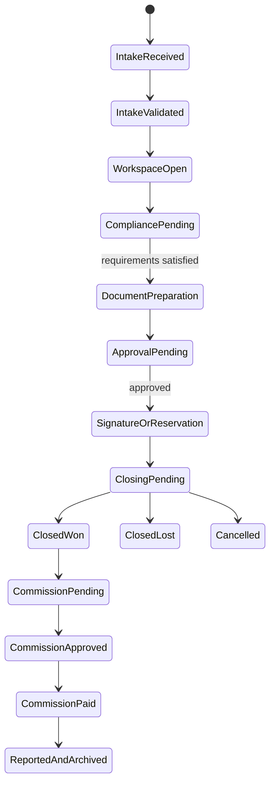

# BluePrint Product Constitution

> **Decision authority:** This is the definitive product-boundary document for BluePrint. Product briefs, wireframes, roadmaps and implementation decisions must conform to it. A material change requires a dated entry in [[../00_Index/Decision Log|Decision Log]] and corresponding updates here, in [[Platform Information Architecture]], [[MVP Scope]], and in the ecosystem maps.

> **v2.0 — Scope redirection, 2026-08-26.** BluePrint is the **back-office brain** of a lean real-estate office, used by administrative staff only. Sales works in GoHighLevel. This version adds the operational domains that v1.0 omitted — service recovery (Glitch Report), HR and people records, legal/licence/asset tracking, the resource directory, the template and manual library, and personal/team performance — and **re-sequences** the transaction/compliance/commission spine from Release 1 to Release 2. See §9.
>
> v2.0 restores architecture originally specified on 2026-07-18 in [[Platform Information Architecture]] and [[Product Modules]] that v1.0 had narrowed away. Build specification: [[BluePrint Wireframe - Back Office OS (Developer Handoff)]].

## 1. Product promise

**BluePrint is the operating brain of a lean real-estate back office.**

A boutique agency runs on three to eight administrative people. Its institutional knowledge — which licences expire when, where the approved templates live, who the accountant is, what went wrong for a client last Tuesday and whether it was put right, how the team is actually performing — today lives in spreadsheets, message threads, individual inboxes and individual memories. BluePrint is where that knowledge lives instead, and where the daily operating rhythm of the office happens.

Standalone promise:

> Run the agency's entire back office from one place: daily service recovery, tasks, people and licence records, legal and asset tracking, approved templates and manuals, contacts and resources, and honest performance information — with a permission-aware assistant that can answer questions across all of it.

Ecosystem promise:

> Connect the same BluePrint workspace to B_RealEstate's training, curated inventory, off-market marketplace, operating standards, benchmarks and shared services without changing the core product.

The measurable outcome is not “everything in one place.” It is **nothing important living only in one person's head or one person's inbox** — expressed as fewer missed renewals, faster recovery when service fails, lower administrative effort, clearer accountability and management information the office actually trusts.

## 2. Product category and boundary

BluePrint is a **multi-tenant real-estate back-office operating platform and system of operational record**.

It is:

- The daily operating rhythm of the office, anchored by the Glitch Report service-recovery review (§10).
- The tracked register of everything with an expiry, an owner or a renewal: contracts, corporate licences, software licences, tax obligations, professional licences and people records.
- The governed library of approved templates and operating manuals.
- The confidential engine for HR cases and internal tickets.
- The directory of the external parties and resources the office depends on.
- The honest performance layer: personal KPIs, team KPIs, satisfaction results and management reports.
- The structured operational memory of the agency.
- The governed interface through which the BluePrint Copilot reads company knowledge and prepares permitted work.
- From Release 2: the transaction workspace and the control layer for compliance gates, documents, approvals and commissions.
- Connector-neutral: it supports GoHighLevel, other CRMs and manual intake through the same domain model.

It is not:

- A lead-generation or marketing automation platform.
- A replacement for GoHighLevel or another CRM.
- A general-purpose chatbot.
- An LMS or course-delivery engine.
- An off-market marketplace.
- A file-storage replacement.
- An e-signature provider.
- A bank, payment rail, escrow provider or general ledger.
- A payroll processor.
- A tool for the sales team (§3.11).
- A source of legal, tax, financial or investment advice.
- A promise that every ecosystem component shares one physical database.

### Non-duplication rendering rule

It is not enough for the boundary above to be true architecturally. **It must be true on screen.** BluePrint must never render a surface that reproduces what a specialist system owns:

| BluePrint must not show | Owner | BluePrint may show |
|---|---|---|
| Lead pipelines, contact-as-CRM views, campaigns, message threads, call logs | GoHighLevel | Aggregate performance metrics received from the CRM, labelled with source and date |
| Lesson content, video players, quizzes, enrolment management | B_Academy (Open edX) | A link to the course and the user's completion/certification status |
| Off-market listing browsing and negotiation | VAULTED | A listing reference on an authorised handoff |
| A file browser or document warehouse | Drive / SharePoint | A stable link, version, owner and review date |
| Signed-document archives | Secure legal archive | Status, expiry, counterparty and responsible owner |

If a proposed screen resembles a row in the left column, it is rejected, not redesigned.

## 3. Product principles

1. **Standalone first, ecosystem amplified.** Every agency receives a complete core workflow; B_RealEstate integrations add leverage rather than unlock basic operability.
2. **One operational spine.** All customers use the same transaction state model. CRM choice changes the intake adapter, not the product.
3. **One owner per fact.** Every important field has a declared system of record and synchronization direction.
4. **Structured data creates documents.** Approved templates and governed inputs generate documents; documents do not become the hidden database.
5. **Human accountability survives automation.** AI may explain, analyze, draft and prepare actions, but accountable people approve legal, compliance and financial consequences.
6. **Need-to-know by default.** Tenant isolation, role permissions and record-level access apply to users, integrations and AI alike.
7. **Explain before surprise.** Status, calculations, AI sources and blocked steps must be understandable.
8. **Exceptions are visible.** A bypass requires authority, reason and an audit event; it cannot silently erase a control.
9. **Integrate specialist tools; do not recreate them.** BluePrint stores references, status and evidence while the specialist platform performs its specialist job.
10. **Measure outcomes.** Features are justified by operational time saved, control improvement, transaction quality or revenue visibility.
11. **Back office only.** BluePrint is licensed and designed for administrative staff — coordinators, managers, principals, C-suite and HQ. Sales advisors work in the CRM and are not given BluePrint seats. A salesperson's time belongs with clients, not behind an internal system. A salesperson may exist in BluePrint *as a record* without ever having a login. This is a product boundary, not a configuration preference, and it governs seat design and pricing.
12. **Recovery over blame.** Where BluePrint records something going wrong, it records what was done to put it right — never who is at fault. No schema, field, metric or screen may attribute a service failure to a named individual as fault. Under-reporting is the failure mode; volume of reports is a health signal, and recovery rate and recovery time are the performance measures.
13. **Build primitives, not modules.** Most back-office surfaces are one of two objects: a tracked record with an owner and an expiry (Registry), or a reported item that gets routed and resolved (Ticket). Build each primitive once, at full strength, and instantiate it by configuration. A proposal that requires a new bespoke module must first prove it is neither primitive.

## 4. What BluePrint owns

| Domain | BluePrint responsibility | Canonical record |
|---|---|---|
| Tenant operations | Company workspace, market configuration, business line and operating settings | Tenant and workspace records |
| Identity authorization | BluePrint roles, permissions and record access; federated identity may come from an external identity provider | Role assignments and access policy |
| **Service recovery** | Glitch reports, daily review, recovery actions, client-made-whole status, patterns and network quality standard | Glitch record and recovery evidence |
| **Ticketing and cases** | HR cases, complaints, internal requests: routing, SLA, confidentiality and resolution | Ticket record with visibility grants |
| **People records** | Team member operational record, role, employment terms, professional licences and expiry, document links | Person record |
| **Legal and asset tracking** | Status, owner, expiry and renewal of contracts, corporate licences, software licences and tax obligations — **not** the signed documents themselves | Registry record + external link |
| **Template and manual library** | Approved template and manual inventory, version, owner, approval and review date | Template and manual registry |
| **Resource directory** | External parties and resources the office depends on: accountants, lawyers, authorities, suppliers, wellbeing services, useful sites | Directory entry |
| **Performance** | Metric definitions, personal and team KPIs, satisfaction surveys, provenance of every number and management reports | Metric definition, metric value and snapshot |
| Opportunity handoff | Operational snapshot of a qualified opportunity and link to its originating CRM record | Intake record + external reference |
| Transaction | Stage, operational owner, requirements, deadlines, blockers, decision trail and outcome | Transaction workspace |
| Project/unit operations | Approved project/unit facts required to execute a transaction; provenance and external source retained | Project/unit operational master |
| Compliance workflow | Requirements, evidence status, reviews, exceptions and approval gates | Compliance check records |
| Template governance | Approved template, jurisdiction, use case, version, effective dates and required inputs | Template registry |
| Generated documents | Draft/final status, template lineage, input snapshot, approval and specialist-storage link | Document record and audit evidence |
| Work coordination | Tasks, owners, due dates, dependencies, escalation and completion evidence | Task and approval records |
| Commission control | Calculation basis, waterfall, expected/approved/paid status and reconciliation references | Commission statement |
| Operational reporting | BluePrint-derived KPIs, workflow health, close status and management reports | Metric definitions and report snapshots |
| Company knowledge | Indexed, permission-filtered references to approved manuals, policies, procedures and templates | Knowledge-source registry |
| AI activity | Request context, sources, draft/action, cost, confirmation and result | AI run and tool-action log |
| Audit | Who changed what, when, why, through which interface and under what authority | Immutable audit event |

## 5. What external systems own

| External system | It owns | BluePrint stores/uses |
|---|---|---|
| GoHighLevel or another CRM | Lead capture, marketing source, conversations, campaigns, nurturing, appointments, pre-handoff qualification **and the entire sales-team user experience** | External ID, qualified snapshot, selected shared fields, operational status returned to CRM, **and aggregate sales/campaign performance metrics consumed inbound for BluePrint dashboards** |
| Open edX | Course content, enrollment, learning activity, assessments and certificates | Identity link, relevant completion/certification status and expiry used for readiness gates |
| Payroll and occupational-health providers | Payroll processing, clinical and medical records, employee assistance case content | Nothing clinical. Only the directory reference to the service and the operational person record |
| VAULTED | Off-market discovery, listing visibility, marketplace access and marketplace engagement | Listing reference and transaction created after an authorized handoff |
| Dproperty Select governance | HQ approval of curated inventory, controlled assumptions, commercial terms and approved materials | Approved project/unit reference and effective version used in a transaction |
| Drive/SharePoint or approved document store | Binary files and folder retention where policy assigns it | Stable file link, metadata, checksum/version reference and access status |
| E-signature provider | Signing ceremony, signer authentication and signature evidence | Envelope ID, status, signed-file reference and evidence link |
| Accounting/payment provider | Ledger, invoices, taxes, money movement, reconciliation and payment evidence | Expected amounts, external transaction/invoice IDs and reconciliation status |
| Identity provider | Authentication and identity proofing when configured | Tenant membership, application role and last verified identity reference |

**Rule:** “Integrated” never means “duplicated without ownership.” The [[../18_Ecosystem/12 - System of Record and Integration Matrix|System of Record and Integration Matrix]] controls the wider ecosystem boundary.

## 6. Three CRM operating modes

> **Release 2 scope.** Intake and transaction creation are not built in Release 1. This section remains binding and unchanged for Release 2 — it is stated here so the connector contract and field-ownership model are designed into the foundation now rather than retrofitted. In Release 1 the only live CRM integration is **inbound performance metrics** (§5), which uses the same external-ID and provenance conventions.

All three modes create the same `Intake` and `Transaction` records and enter the same workflow.

### Mode A — Ecosystem Connected

**Customer:** Dproperty franchise or B_RealEstate partner using the configured GoHighLevel environment.

- GoHighLevel owns lead capture, communication and qualification.
- A configured qualifying stage/event creates a BluePrint intake.
- BluePrint returns operational status, selected milestone and closing outcome.
- Identity may be federated for a unified experience.
- Ecosystem inventory, Academy and benchmark features may be enabled by entitlement.

### Mode B — External CRM Connected

**Customer:** Independent agency retaining its own CRM.

- The customer's CRM remains the front-office source of truth.
- Intake arrives through the standard API/webhook contract or a supported connector.
- External IDs and field ownership prevent duplicate records and sync loops.
- Only the minimum authorized client/opportunity information is transferred.
- BluePrint returns operational milestones through the same integration contract where supported.

### Mode C — BluePrint Direct

**Customer:** Small/new agency without a connected CRM, or an agency operating temporarily without integration.

- Authorized users create an intake through a guided form or CSV import.
- BluePrint stores only the operational contact/opportunity snapshot required for the transaction.
- BluePrint does not add campaign, bulk messaging or nurture functionality.
- The same workflow begins after validation; no “lite” transaction model is created.

### Connector contract

Every intake records:

- `tenant_id`
- `intake_id`
- `source_mode`
- `external_system`
- `external_record_id`
- `external_record_url`
- `source_event_id` or import batch
- `received_at`
- `last_synced_at`
- field ownership map
- consent/privacy flags received from the source
- idempotency key
- processing and error state

Repeated events must update or reject safely; they must not create duplicate transactions.

## 7. Core data entities

| Domain | Core entities | Purpose |
|---|---|---|
| Tenancy and security | Tenant, Workspace, Market, User, Role, Permission, Membership | Isolation and authorized access |
| Parties | Person, Organization, Party Role, Contact Reference | Transaction participants without recreating CRM marketing history |
| Intake | Intake, Source Reference, Qualification Snapshot, Assignment | Normalize CRM/manual entry |
| Transaction | Transaction, Stage, Milestone, Activity, Exception, Outcome | Operational spine |
| Inventory | Project, Unit, Listing Reference, Availability Snapshot, Commercial Term Version | Transaction-ready property context |
| Compliance | Requirement, Check, Evidence, Review, Decision, Exception | Gate progression and prove control |
| Documents | Template, Template Version, Data Schema, Document, File Reference, Signature Envelope | Govern creation and lifecycle |
| Work | Task, Checklist, Dependency, Approval, Escalation, SLA | Coordinate people and controls |
| Finance | Commission Rule, Calculation, Statement, Payout Allocation, Invoice Reference, Reconciliation | Make economics visible and auditable |
| Knowledge | Knowledge Source, Procedure, Policy, Manual Section, Effective Version | Ground users and Copilot |
| **Registry** | Registry, Registry Type, Registry Record, Renewal Rule, External Link, Alert | One primitive behind contracts, licences, taxes, people, templates, manuals and directory |
| **Ticketing** | Ticket, Ticket Type, Ticket Comment, Resolution, Visibility Grant, SLA Rule | One primitive behind glitches, HR cases and internal requests |
| **Service recovery** | Glitch, Recovery Action, Glitch Pattern, Daily Review | Four Seasons–model service recovery (§10) |
| **People** | Person Record, Professional Licence, Employment Term, Document Link | Team operational record and licence expiry control |
| Reporting | Metric Definition, Metric Value, Metric Source, Report, Snapshot, Survey, Survey Response, Benchmark Cohort | Reproducible management information with declared provenance |
| Integration | Connection, Mapping, Sync Event, Webhook Event, Error, Retry | Connector-neutral interoperability |
| AI and audit | Conversation, AI Run, Citation, Proposed Action, Confirmation, Audit Event | Safe assistance and traceability |

Every tenant-owned entity carries, at minimum, a stable ID, `tenant_id`, creation/update timestamps, actor/provenance, lifecycle status and access classification. Sensitive entities also carry retention and jurisdiction attributes.

## 8. Canonical transaction state model

> **Release 2 scope.** Unchanged and still binding for Release 2. Not built in Release 1.

Stages are stable across customers. Market, business-line and tenant configurations determine the requirements, templates, roles, calculations and approvals inside a stage.

## 9. Release boundary

> **Changed in v2.0.** v1.0 defined a single MVP built around the transaction spine. The founder pain assessment of 2026-08-26 established that the office's actual daily pain is back-office administration, not transaction control. The scope is therefore delivered in sequenced releases. Nothing is cancelled; the order changed.

### Foundation — inside Release 1, at full strength

Multi-tenant workspaces, authentication, roles, record-level access, confidentiality tiers, immutable audit and the base entity conventions of §7.

> This foundation is shared with every later release. Phasing the **modules** is safe. Shortcutting the **foundation** turns Release 2 into a rewrite and defeats the sequencing decision entirely. It is not optional and it is not deferrable.

### Release 1 — The Back Office Brain

1. Foundation as above, plus the design system.
2. The **Registry** primitive and the **Ticket** primitive (§3.13).
3. **Glitch Report:** one-click reporting from any screen, the daily review, roll-forward of unrecovered items, recovery capture and the pattern dashboard (§10).
4. **Tasks** with provenance links back to the record that generated them.
5. **Legal and assets:** contracts, corporate licences, software licences, tax obligations, renewal alert engine and the 12-month expiry calendar.
6. **People:** team records, professional licences and expiry, employment terms, document links; confidential HR cases with anonymous submission; wellbeing resource links.
7. **Library:** approved template registry and operating manuals, versioned and review-dated; link-outs to B_Academy.
8. **Directory:** external contacts and resources.
9. **Performance:** metric definitions, native BluePrint metrics, satisfaction surveys, personal and team dashboards, and a CSV bridge for CRM-sourced metrics with visible provenance.
10. **Copilot** across all of the above (§11).
11. Administration: users, permissions, metric definitions, integrations and the audit viewer.

### Release 1.5

The GoHighLevel metrics connector replaces the CSV bridge, feeding the **same** metric definitions and the **same** dashboards. Satisfaction survey automation.

### Release 2 — The Transaction Spine

Intake across all three CRM modes, transaction workspace, compliance gates, governed document generation, e-signature handoff, deterministic commission calculation and transaction reporting.

The canonical wireframe, three-mode desk test and acceptance criteria are unchanged and remain in [[BluePrint Golden Workflow - Wireframe and Validation]]. The three CRM operating modes of §6 and the state model of §8 remain binding for Release 2 and are not diluted by the re-sequencing.

### Explicitly outside all current releases

- Marketing automation, bulk messaging, call tracking, lead nurture or any sales-team-facing surface.
- A full accounting, invoicing, tax, banking, escrow, payment or payroll product.
- Course authoring or delivery.
- VAULTED marketplace browsing/negotiation implementation.
- Full Dproperty Select curation workflow beyond approved-data consumption.
- Native file-storage or e-signature infrastructure.
- Clinical, medical or employee-assistance case content.
- Advanced AI autonomy, unsupervised external communication or automatic legal/compliance approval.
- Cross-tenant benchmarking until privacy thresholds and metric consistency are proven.
- General-purpose custom workflow builder.
- Client portal, developer portal and mobile-native applications unless required by the pilot.
- Complex multi-market localization beyond the first approved market pack.

### Release 1 wedge

Release 1 succeeds when a real Dproperty back office **runs its morning meeting from the Daily Review screen for four consecutive weeks**, and when no expiring licence, contract or renewal in that period is discovered late.

That is the adoption test: a product the office opens every morning by habit. Full acceptance criteria are in [[BluePrint Wireframe - Back Office OS (Developer Handoff)]] §10.

## 10. Service recovery constitution (Glitch Report)

BluePrint's Glitch Report implements the Four Seasons operating model: a daily, transparent, no-blame review of service failures, focused on recovery rather than fault. Isadore Sharp's premise governs the design — *guest loyalty is secured not by avoiding every error, but by how genuinely and effectively the failure is recovered.*

This is not a bug tracker. Software defects are one narrow category within it.

### Binding mechanics

1. **Daily cadence.** The Daily Review screen is the morning meeting artefact, replacing the printout. It supports a full-screen presentation mode.
2. **Grouped by responsible department**, so each head speaks to their own block.
3. **Roll-forward.** An open glitch reappears on every subsequent Daily Review with a visible day counter until it is closed. Nothing falls between the cracks.
4. **Recovery is mandatory to close.** A glitch cannot be closed without a recorded recovery action and an explicit statement of whether the client was made whole.
5. **No fault field.** No schema field, metric, filter or screen may attribute a glitch to a named individual as fault. Ownership means accountability for recovery, never blame.
6. **Near-zero friction.** Reportable from any screen, in under twenty seconds, with exactly one required field. Context is auto-captured.
7. **Pattern analysis over incident count.** The operative value is discovering that six incidents share one root cause.
8. **Linked to the client and to satisfaction results**, so recovery effectiveness is measurable rather than asserted.

### Metric design rule

**Under-reporting is the failure mode, not glitch volume.** Reporting rate is displayed as a health signal with a healthy floor; a department reporting zero glitches is a red flag, not an achievement. Recovery rate and recovery time are the performance measures. No dashboard, review, incentive or franchise-standard may penalise a high report count. Violating this rule ends honest reporting within weeks and reduces the system to theatre.

### Network quality standard

For HQ, cross-tenant glitch and recovery rates are the instrument that turns "premium boutique experience" from a brand promise into an enforceable, measurable operating standard across franchises. This is a franchise governance capability, not merely an internal tool (§12).

## 11. BluePrint Copilot constitution

### Promise

The Copilot is a permission-aware operational assistant that understands BluePrint, the user's company configuration, authorized company knowledge and the current record. It helps the user find, understand, summarize, draft and prepare work inside the product.

It is not an open-ended ChatGPT replacement. It must stay within BluePrint's supported domains and state when a request is outside its authority or evidence.

### Permission levels

| Level | Capability | MVP behavior | Examples |
|---|---|---|---|
| AI-0 — Explain and retrieve | Read authorized product/company knowledge | Execute immediately; cite sources | “How do I register a reservation?” “Find the approved NDA.” |
| AI-1 — Summarize and analyze | Read authorized records and compute through approved tools | Execute immediately; show sources, period and definitions | Transaction summary, missing-items list, KPI explanation |
| AI-2 — Draft | Create non-final content from approved templates and structured inputs | Save as draft; show template/version and missing inputs | NDA draft, weekly report, task checklist |
| AI-3 — Prepare an action | Assemble a proposed change or external handoff | Preview impact; require explicit user confirmation; log result | Create tasks, update non-restricted status, prepare e-signature envelope |
| AI-4 — Restricted authority | Approve, sign, pay, publish, waive controls or make regulated decisions | **AI prohibited. Human role performs the decision.** | Compliance approval, contract signature, payment release, commission approval, template publication |

Tenant and role permissions always override the general AI level. The Copilot cannot retrieve or act on a record the requesting user cannot access directly.

### Mandatory guardrails

- Tenant isolation at retrieval, prompt construction, tool execution, caches and logs.
- Need-to-know record filtering before model invocation.
- Sources/citations for company knowledge, policy, procedure and KPI answers.
- No invented field values. Missing required inputs are requested explicitly.
- Template and template-version provenance on every generated document.
- Deterministic services—not model arithmetic—for commissions, projections and KPI calculations.
- Human approval for legal, compliance, financial, signature and external-communication consequences.
- Full audit of prompt category, sources, model, tools, output, confirmation and cost; sensitive raw content retained only under approved policy.
- Clear uncertainty and refusal when evidence is missing, conflicting, expired or unauthorized.
- No learning across tenants from customer content without an explicit, legally approved program.

### AI economics

BluePrint owns the Copilot experience, knowledge architecture, permissions, evaluation suite, tools, routing and cost policy while using approved foundation-model APIs.

- Include a defined monthly AI allowance by subscription tier.
- Meter usage by tenant and capability.
- Route retrieval/classification and simple summaries to cost-efficient models.
- Use stronger models only for approved complex drafting/analysis.
- Use deterministic code for calculations and rules.
- Cache reusable non-sensitive results where safe.
- Alert and throttle before a tenant exceeds its allowance; offer priced overage rather than silent margin erosion.

Pricing amounts remain controlled by the financial model and [[../18_Ecosystem/14 - Unit Economics Registry|Unit Economics Registry]].

## 12. Standalone versus ecosystem capabilities

| Capability | BluePrint standalone | With B_RealEstate ecosystem |
|---|---|---|
| Service recovery (Glitch Report) | Full, tenant-only patterns | Network quality standard, cross-office benchmarking and HQ improvement backlog |
| Legal, licence and asset tracking | Full, customer-configured | Market packs with jurisdiction-specific licence and obligation templates |
| People and HR cases | Full | HQ-shared HR escalation and network wellbeing panel |
| Library — templates and manuals | Customer's own materials | B_RealEstate/Dproperty approved template and manual packs by entitlement |
| Performance and satisfaction | Tenant metrics and surveys | Network-standard metric definitions and later privacy-safe benchmarks |
| Directory | Customer's own contacts | Network-preferred suppliers and shared-service contacts |
| Transaction workflow *(Release 2)* | Full | Full, with ecosystem configurations |
| CRM | Any supported external CRM or direct intake | Preconfigured GoHighLevel handoff, status return and inbound performance metrics |
| Documents | Customer's approved templates | B_RealEstate/Dproperty template packs subject to entitlement and localization |
| Compliance | Customer-configured/approved requirements | Market packs, operating standards and HQ oversight where contracted |
| Knowledge and SOPs | Customer's materials | B_RealEstate manuals, playbooks and shared-service guidance |
| Academy | Links or external certification reference | Open edX provisioning and certification/readiness gates |
| Inventory | Customer's project/unit records and external references | Dproperty Select approved inventory and VAULTED handoffs where entitled |
| Reporting | Tenant operational and financial-control metrics | Network-standard definitions and later privacy-safe benchmarks |
| Support | Product support | Product support plus contracted launch/coaching/shared services |
| Copilot | Customer knowledge + BluePrint help + tenant records | Adds authorized ecosystem manuals, inventory context and operating rules |

No standalone customer must join Dproperty, adopt GoHighLevel, use VAULTED or consume B_RealEstate inventory to obtain the core workflow.

## 13. Product shell

The Release 1 navigation is:

1. **Today** — what needs me now: the daily glitch review, my tasks, expiring items, my KPIs
2. **Glitches** — report, daily review, pattern dashboard
3. **Tasks**
4. **Performance** — personal KPIs, team KPIs, satisfaction, reports
5. **People** — team records, licences, HR cases, wellbeing
6. **Legal** — contracts, licences, software, taxes, renewal calendar
7. **Library** — templates, manuals, Academy links
8. **Directory** — external contacts and resources
9. **Administration** *(Principal/HQ only)*

Release 2 adds **Transactions**, **Documents** and **Finance** to this shell rather than replacing it.

Three elements are present on every screen: the **Command Bar** (universal search and command palette — "three clicks to anything"), the **Report a Glitch** control, and the **Copilot** context panel. The interface opens on **what requires attention**, not on every available module.

External systems appear in the shell as clearly marked launch links (CRM ↗, Academy ↗) that open the specialist system through SSO. They are never rendered inside BluePrint (§2).

Visual system, tokens and component specifications: [[BluePrint Wireframe - Back Office OS (Developer Handoff)]] §3.

## 14. Non-functional release gates

- No cross-tenant data path in automated security tests.
- Role and record-level authorization enforced server-side for UI, API, exports and AI tools.
- Audit event for every restricted data change, approval and external handoff.
- Retry-safe and idempotent integration events.
- Time-zone, currency and jurisdiction attributes are explicit; no hidden tenant-wide assumption where a transaction can differ.
- Accessibility baseline for keyboard navigation, form labels, focus, contrast and reduced motion.
- Exportability of tenant-owned operational data and documented retention/deletion controls.
- Backups, recovery objectives and incident response defined before production use.
- Model/provider substitution possible without rewriting product permissions or domain services.

## 15. Success measures

The pilot baseline must be recorded before targets are finalized.

### Release 1

- Daily Review held on consecutive working days (the adoption measure).
- Glitch reporting rate per person — watched for a healthy floor, never penalised.
- Recovery rate and median time to recovery.
- Repeat rate of the same glitch pattern after a prevention action.
- Renewals discovered late: target zero.
- Registry currency — percentage of records with a valid owner and review date.
- Time to find an approved template, manual section or contact.
- HR case time-to-acknowledgement.
- Copilot answer traceability, user corrections and cost per successful task.
- User-reported confidence: “I know what needs attention and why.”

### Release 2

- Time from qualified handoff to transaction workspace.
- Duplicate-entry rate and synchronization failures.
- Percentage of transactions with complete required evidence at each gate.
- Document preparation and approval cycle time.
- Commission calculation/reconciliation errors.
- Time required to produce the weekly management report.

## 16. Change control

A proposal changes this Constitution when it alters the product promise, source-of-truth ownership, canonical state model, CRM modes, release boundary or sequencing, AI authority, the back-office-only access boundary (§3.11), the no-blame recovery rule (§3.12, §10) or standalone entitlement.

For such a change:

1. State the operational problem and evidence.
2. Identify the Constitution clause affected.
3. Analyze impacts on all three CRM modes.
4. Analyze security, legal, financial, integration and AI consequences.
5. Record the approved decision and effective version.
6. Update dependent maps, specifications, tests, public claims and contracts together.

Implementation details that do not change these boundaries may evolve through normal product design.
