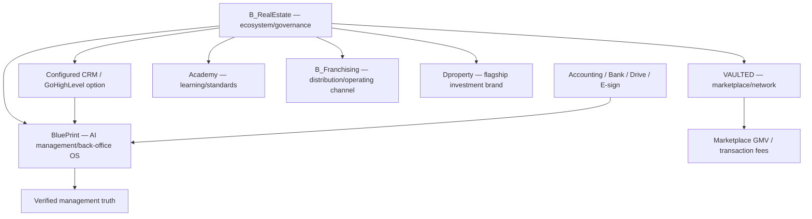

# B_RealEstate — Ecosystem Master Map

## Strategic definition

B_RealEstate is the parent ecosystem. The business is increasingly structured around **independently sellable software/network products**, with franchising and white-label relationships functioning as distribution and operating channels rather than defining the software itself.

## Ecosystem view

## Component map

| Component | Job | Primary buyer/user | Owns | Is not |
|---|---|---|---|---|
| **BluePrint** | Chat-first management control/back-office operating system | Small/growing agencies; owner + administrator | Management truth, budgets, processes, glitches, management actions, reporting, audit | CRM, ERP ledger, property inventory, marketplace |
| **GoHighLevel / configured CRM** | Front-office acquisition, communication and sales workflow | Sales/marketing teams | Leads, conversations, campaigns, appointments, agent pipeline state | Corporate truth or accounting system |
| **VAULTED** | Private marketplace/network for inventory and demand | Approved brokers/agencies/investors | Marketplace listings, access, introductions, engagement and marketplace attribution | BluePrint database or Dproperty Select |
| **Academy** | Learning, standards and certification | Operators/teams | Courses, learning activity, assessments | Management OS |
| **B_Franchising** | Distribution/brand/operating model | Franchise principals | Franchise relationship, brand standards and support model | The core software product |
| **Dproperty** | Flagship investment real-estate brand | Investors/franchisees | Brand/client proposition | Parent ecosystem |
| **Dproperty Select** | HQ-curated inventory program | Dproperty/eligible partners | Curation decisions, approved terms/access rules | Open marketplace |

## Core flows

### Sales/front-office flow
Demand → CRM → sales activity/pipeline. BluePrint may read management-relevant outcomes, but sales execution remains in CRM.

### Management-control flow
CRM + accounting + bank/payment + documents + human reports → BluePrint provenance/verification → budgets/process controls/incidents/actions → management reports/decisions.

### VAULTED network flow
Eligible listing/supply → VAULTED → qualified discovery/introduction → transaction executed through responsible parties/systems → marketplace attribution/fee → verified outcome may feed BluePrint management reporting.

### Capability flow
Academy teaches standards and roles; BluePrint can reference certification/readiness where useful, but the LMS remains separate.

## Design principles

1. One authority per data class.
2. BluePrint does not rebuild CRM or accounting.
3. Human language can be the interface; structured records remain underneath.
4. CRM data is reported evidence, not automatically corporate truth.
5. Human approval for financial/legal/sensitive consequences.
6. Independent BluePrint customers must have tenant isolation from franchise commercial operations.
7. Prove the management-control wedge before adding breadth.

## Canonical BluePrint sources

- [[../04_Product/BluePrint/00 - README - Product Map]]
- [[../04_Product/BluePrint/01 - Product Constitution]]
- [[../04_Product/BluePrint/07 - MVP and Validation Plan]]
- [[12 - System of Record and Integration Matrix]]
