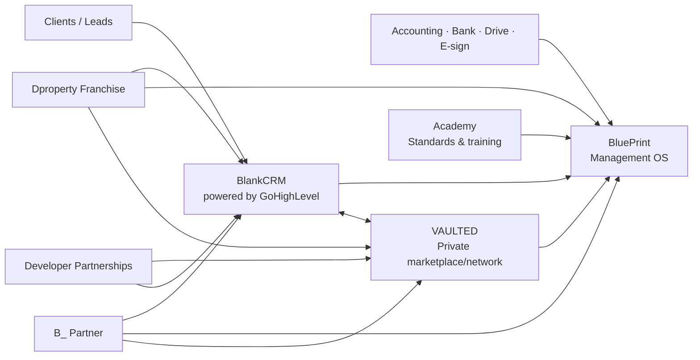

# B_RealEstate — Ecosystem Master Map

## One-sentence definition

**B_ is operating infrastructure for real-estate businesses: BlankCRM helps the team sell, BluePrint helps management run the company, and VAULTED connects the company to a transaction network.**

## Core architecture

## Product hierarchy

| Product | Core job | Strategic role |
|---|---|---|
| **BluePrint** | Run/control the company | Proprietary SaaS/IP |
| **BlankCRM** | Generate, organize and convert demand | Attach/acquisition product; third-party engine |
| **VAULTED** | Access/match network supply and demand | Network effect + GMV/take-rate upside |
| **Academy** | Teach standards and close capability gaps | Retention/quality/enablement |

## Distribution and monetization channels

| Channel | Role |
|---|---|
| **Dproperty Franchise** | Branded, vertically integrated deployment of the stack |
| **B_ Partner** | Managed stack/operating model under customer's own brand |
| **Developer Partnerships** | Revenue + supply + distribution + product learning |
| **Direct SaaS** | BluePrint and/or BlankCRM sold to independent agencies |
| **VAULTED network** | Marketplace participation independent of franchise status where eligible |

## Strategic assets

- **Dproperty** — flagship investment brand/testbed/distribution.
- **Dproperty Select** — HQ-curated opportunities; may appear as a curated collection inside VAULTED.
- Existing developer/broker/investor relationships — cold-start advantage.
- Second Brain/process library — internal institutional knowledge; feeds product/Academy but is not a customer product.

## Long-term option

A physical real-estate innovation hub may remain a future expression of the network, but the software/network business must be valuable and defensible without it.
