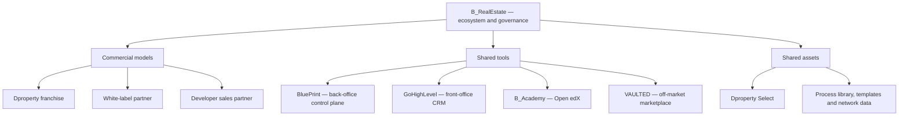

# B_RealEstate — Ecosystem Master Map

## Strategic definition

B_RealEstate is the parent real-estate operating ecosystem. It turns the knowledge, operating method, inventory access, commercial relationships, data and brand equity built through Dproperty into infrastructure that other operators can use under three commercial models: Dproperty franchise, white-label partnership, and developer sales partnership.

The ecosystem is not a single app. It is a governed operating model in which each component has one clear job and exchanges controlled data with the others.

## The ecosystem in one view

## Component map

| Component | Job | Primary user | Source of truth for | Is not |
|---|---|---|---|---|
| B_RealEstate | Ecosystem governance, product portfolio, standards and partner growth | HQ and prospective partners | Brands, service lines, governance and network rules | A consumer property brand |
| BluePrint | Back-office control plane | HQ, principals, operations, agents | Transactions, project intelligence, documents, projections, commissions, approvals, operating KPIs | CRM, LMS, marketplace, Drive or accounting system |
| GoHighLevel | Front-office acquisition and communication | Sales and marketing teams | Leads, contacts, conversations, calendars, campaigns and pre-qualification pipeline | Legal, project, commission or document source of truth |
| B_Academy / Open edX | Learning delivery and assessment | Franchise and partner teams | Courses, lessons, assessments and learning activity | Operations manual repository or user-permission engine |
| VAULTED | Private off-market discovery and exchange | Approved brokers, investors and ecosystem members | Marketplace listings, invitations and marketplace engagement | Internal project underwriting or transaction back office |
| Dproperty Select | HQ-curated, investment-grade inventory program | Dproperty and eligible partner channels | Curation decision, approved terms and access rules | An open catalogue editable by franchisees |
| Dproperty | Flagship investment brand | Investors and branded franchisees | Flagship brand promise and investment-only positioning | Parent company or generic residential brand |
| White-label | Partner model under the partner's own brand | Established boutique agencies | Partner's brand and local client proposition | Discount Dproperty franchise |
| Developer Sales Partner | Dedicated commercial team and operating system for developers | Developers | Project sales operating mandate and reporting | Generic broker distribution or temporary outsourced desk |
| DpropertyLiving | Proposed end-user/lifestyle extension shown on live site | Homebuyers and Dproperty-originated end users | Not yet decided | A fourth ecosystem entry model until formally approved |

## Value flows

### Demand flow

Public site or campaign → GoHighLevel → qualification → BluePrint transaction → project/unit match → documents/projection → reservation/closing → commission and reporting → milestones returned to GoHighLevel.

### Inventory flow

Developer/project intake → BluePrint due diligence and commercial terms → Dproperty Select approval where applicable → controlled publication to VAULTED and relevant partner channels → buyer activity → BluePrint transaction.

### Capability flow

Role assigned in BluePrint → required learning path assigned in Open edX → completion/certification returned to BluePrint → permission or readiness gate updated.

### Knowledge flow

Transactions and exceptions in BluePrint → anonymized benchmarks and process improvements → updated manuals/templates/training → improved execution across the network.

## Commercial doors

1. **Dproperty franchise:** operate under the flagship investment brand.
2. **White-label partner:** keep or build the partner's own brand using B_RealEstate infrastructure.
3. **Developer Sales Partner:** use a dedicated commercial team and system across the developer's portfolio.

DpropertyLiving is documented separately because the live site presents it as a brand, but it must not be treated as a fourth commercial door until ownership, positioning, economics and brand rules are approved.

## Design principles

1. One source of truth per object.
2. Data first, documents second.
3. Automation first; AI only where language work benefits.
4. Human approval for legal, financial and client-facing commitments.
5. One identity, role-gated experiences and clear tenant isolation.
6. No duplicate manual entry between GoHighLevel, BluePrint, Open edX and VAULTED.
7. Build the transaction spine before secondary modules.

## Canonical related files

- [[12 - System of Record and Integration Matrix]]
- [[13 - Personas and Jobs to Be Done]]
- [[14 - Unit Economics Registry]]
- [[16 - Roadmap and Governance]]

